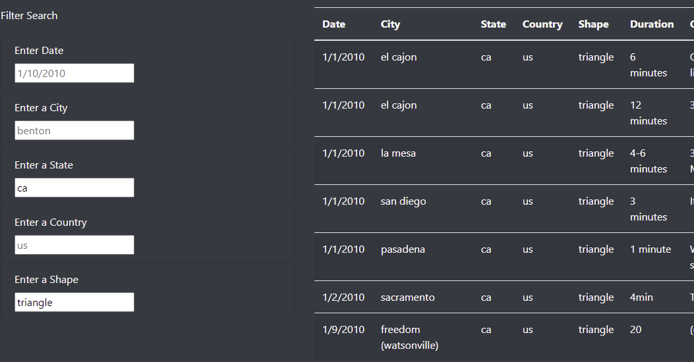

# UFO Finder 
## Project Overview: 
The project builds a web application that displays data on UFO sightings in a table using JavaScript programming language. The web app includes tha ability to filter the data, providing users an ability for a more in-depth analysis of UFO sightings in different cities around the world. 

## Results: 
The project is completed with a web page that allows the data to be filtered using five different filters that can separate the UFO sightings based on the day of alleged observation, city, state, country, and the shape of the alleged UFO. The search can be completed by inputting the desired specifications in the format shown by placeholders in the input fields and pressing 'Enter'. The table to the immediate right will filter the data according to the specifications. Several specifications can be input, as demonstrated in the image below. To reset the table, the user must click on 'UFO Sightings' on the navigation bar on the top of the page. 

### Demo:

The above image demonstrates the results after filtering the table to show results for the observations of oval shaped UFOs in California. 

## Summary: 
### Drawbacks of the page: 
The page lacks in functionality. Please see below suggestions on improving the functionality. Users are not offered a menu of available filters to choose from. It is not clear whether the reset table contains all the data. Data contains records of 2010 only. 

### Recommendations for improvement: 
1. Replace filtering based on text input with filtering from the table headers using a dropdown menu, similar to Excel style filters. 
2. Add a clear function that resets the table.
3. Add more credentials and links to the page, include a column with functional references for each alleged observation.
